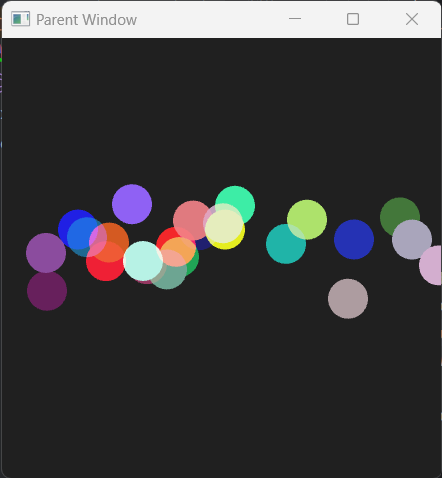

# sfml-embedded

## what is it

it's an extension to SFML that creates embedded render windows (sf::RenderWindow). It primarily targets audio plugins (VST3, CLAP), where a parent window is handed off to a plugin, so that a child window can be attached to it.


## dependencies

There are no dependencies outside of SFML, unless you want to enable logging. In which case, you'll need https://github.com/gabime/spdlog.

## build

It's currently only a static Windows library. run cmake
```bash
cd /path/to/sfml-embedded
mkdir build
cd build
cmake -DSFML_DIR=/path/to/sfml/cmake/files ..  
```

## logging

Because stderr isn't available in most circumstances, an optional built-in logger is provided via spdlog.

It can be enabled when building the library by using:

```bash
cd /path/to/sfml-embedded
mkdir build
cd build
cmake -DSFML_DIR=/path/to/sfml/cmake/files -DSPDLOG_DIR=/path/to/spdlog/include ..  
```

in application code, the following cmake option can be used to automatically include it

```cmake
add_definitions( -DSFML_EMBEDDED_LOGGING )
```

```c++
// before any logging can be used, it must be initialized
sf::EmbeddedLogger::initializeLogger( "/path/to/log/file.txt" );

// now you can use all the logging macros
LOG_ERROR( "check out this variable {}", myVar );
```

There are 3 built-in types of loggers and they can be combined. Arbitrary sinks can be added for more flexibility.

```c++
// 1. log to file
sf::EmbeddedLogger::initializeLogger( "/path/to/log/file.txt" );
// 2. log to console
sf::EmbeddedLogger::initializeConsole();
// 3. log nowhere
sf::EmbeddedLogger::initializeNullLogger();
// 4. any sink
sf::EmbeddedLogger::addSink( myCustomSpdlogSink );
```

## VST3 Example

### create the IPluginView, which sets up our embedded window

```C++
class VST3EmbeddedWindow : public Steinberg::CPluginView
{
public:

  explicit VST3EmbeddedWindow( Steinberg::ViewRect viewRect )
  {
    this->rect = viewRect;
  }

  Steinberg::tresult isPlatformTypeSupported( Steinberg::FIDString type ) override
  {
    // Windows platform
    if ( strcmp( type, Steinberg::kPlatformTypeHWND ) == 0 )
      return Steinberg::kResultTrue;

    return Steinberg::kResultFalse;
  }

  Steinberg::tresult attached( void *parent, Steinberg::FIDString type ) override
  {
    m_ptrChildWindow =
      std::make_unique< sf::EmbeddedWindow >( (sf::WindowHandle )parent,
                                              m_eventReceiver,
                                              sf::ContextSettings { 0, 0, 2, 4, 6 } );

    return Steinberg::kResultTrue;
  }

private:

  std::unique_ptr< sf::EmbeddedWindow > m_ptrChildWindow;
  VST3EmbeddedWindowEventReceiver m_eventReceiver;

};
```

### create the event receiver / callback class
```C++
class VST3EmbeddedWindowEventReceiver : public sf::EmbeddedWindowEventReceiver
{
public:

  void onWindowCreated( const sf::EmbeddedWindow& emWin, sf::RenderWindow &window ) override
  {
    m_shape.setSize( { 50, 50 } );
    m_timer.restart();
  }

  void onWindowDestroyed( const sf::EmbeddedWindow&, sf::RenderWindow &window ) override
  {}

  void onError() override
  {}

  void onFrame( const sf::EmbeddedWindow& embeddedWindow, sf::RenderWindow &window ) override
  {
    if ( m_timer.getElapsedTime().asSeconds() > 5 )
    {
      if ( m_shape.getFillColor() == sf::Color::Green )
        m_shape.setFillColor( sf::Color::White );
      else
        m_shape.setFillColor( sf::Color::Green );

      m_timer.restart();
    }

    sf::Event event {};
    while ( window.isOpen() && window.pollEvent( event ) )
    {
      if ( event.type == sf::Event::Closed )
        break;

      if ( event.type == sf::Event::MouseButtonPressed )
      {
        auto relPosition = embeddedWindow.getCursorPosition();

        if ( m_shape.getGlobalBounds().contains( ( float )relPosition.x, ( float )relPosition.y ) )
        {
          if ( m_shape.getFillColor() == sf::Color::Magenta )
            m_shape.setFillColor( sf::Color::Cyan );
          else
            m_shape.setFillColor( sf::Color::Magenta );
          m_timer.restart();
        }
      }
    }

    window.clear( sf::Color( 32, 32, 32 ) );
    window.draw( m_shape );
    window.display();
  }

private:

  sf::RectangleShape m_shape;
  sf::Clock m_timer;

};
```
## SFML Parent Window to Child Window Example

Note that it's possible to create a parent that has splitscreens with multiple child render windows
that are independent of each other, but managing the coordinates correctly can be challenging.



```c++
#include <ctime>
#include <random>

#include <SFML/Graphics.hpp>
#include <SFML/Embedded.hpp>

namespace nx
{

class EventReceiver : public sf::EmbeddedWindowEventReceiver
{
public:

  EventReceiver() = default;

  ~EventReceiver() = default;

  void onWindowCreated( const sf::EmbeddedWindow &embeddedWindow, sf::RenderWindow &window ) override
  {
    m_rndgen.seed( std::time( nullptr ) );
    window.setActive();
    window.requestFocus();

    for ( auto& shape : m_shapes )
      initializeShape( shape, window.getSize() );

    m_timer.restart();
  }

  void onWindowDestroyed( const sf::EmbeddedWindow &embeddedWindow, sf::RenderWindow &window ) override
  {}

  void onError() override
  {}

  void onFrame( const sf::EmbeddedWindow &embeddedWindow, sf::RenderWindow &window ) override
  {
    sf::Event event {};
    while ( window.isOpen() && window.pollEvent( event ) )
    {
      if ( event.type == sf::Event::Closed )
        return;

      if ( event.type == sf::Event::MouseButtonReleased &&
           event.mouseButton.button == sf::Mouse::Button::Left )
      {
        auto mousePosition = embeddedWindow.getCursorPosition();

        for ( uint32_t i = 0; i < m_shapes.size(); ++i )
        {
          if ( m_shapes[ i ].getGlobalBounds().contains( ( float )mousePosition.x, ( float )mousePosition.y ) )
          {
            LOG_INFO( "Clicked on shape {}", ( i + 1 ) );
            break;
          }
        }
      }
    }

    updateObjects( m_timer.restart(), window.getSize() );
    window.clear( { 32, 32, 32 } );
    for ( auto& shape : m_shapes )
      window.draw( shape );

    window.display();
  }

private:

  void initializeShape( sf::CircleShape& shape, const sf::Vector2u& winSize )
  {
    // reset its position
    shape.setPosition( { ( float )( m_rndgen() % winSize.x ), 0.f } );
    shape.setFillColor( { ( uint8_t )( m_rndgen() % 255 ),
                          ( uint8_t )( m_rndgen() % 255 ),
                          ( uint8_t )( m_rndgen() % 255 ) } );
  }

  void updateObjects( const sf::Time& delta, const sf::Vector2u& winSize )
  {
    for ( auto & shape : m_shapes )
    {
      auto pos = shape.getPosition();
      shape.setRadius( 20.f );

      if ( pos.y > winSize.y )
        initializeShape( shape, winSize );
      else
      {
        auto randomDrag = ( float )( m_rndgen() % ( uint32_t )( sm_pixelsPerSecond * sm_drag ) );
        auto movement = delta.asSeconds() * sm_pixelsPerSecond * sm_velocity + randomDrag;
        shape.move( { 0.f, movement } );
      }
    }
  }

private:

  static const inline float sm_drag { .25f };
  static const inline float sm_velocity { 1.f };
  static const inline float sm_pixelsPerSecond { 10.f };

  std::uniform_int_distribution< int > m_distribution;
  std::mt19937 m_rndgen;

  std::vector< sf::CircleShape > m_shapes { 25 };
  sf::Clock m_timer;

};
}

int main()
{
  sf::EmbeddedLogger::initializeConsole();
  sf::Window window;

  window.create( sf::VideoMode { 440, 440 }, "Parent Window" );
  window.setFramerateLimit( 60 );

  window.setPosition( { 40, 40 } );

  nx::EventReceiver eventReceiver;
  sf::EmbeddedWindow emWin( window.getSystemHandle(), eventReceiver );

  sf::Vector2i winPos = { -1, -1 };

  while ( window.isOpen() )
  {
    sf::Event event {};
    while ( window.pollEvent( event ) )
    {
      if ( event.type == sf::Event::Closed )
        return 0;
    }

    auto nextWinPos = window.getPosition();
    if ( nextWinPos != winPos )
    {
      LOG_INFO( "parent window position: {}, {}", nextWinPos.x, nextWinPos.y );
      winPos = nextWinPos;
    }

    // no need to refresh the parent unless making the child window smaller than the parent
    // which is not recommended
    // window.display();
  }

  return 0;
}
```

## License

Same license as SFML [zlib/libpng license](https://opensource.org/licenses/Zlib).

Copyright (c) 2023 Nicholas Reimer

This software is provided ‘as-is’, without any express or implied
warranty. In no event will the authors be held liable for any damages
arising from the use of this software.

Permission is granted to anyone to use this software for any purpose,
including commercial applications, and to alter it and redistribute it
freely, subject to the following restrictions:

1. The origin of this software must not be misrepresented; you must not
   claim that you wrote the original software. If you use this software
   in a product, an acknowledgment in the product documentation would be
   appreciated but is not required.

2. Altered source versions must be plainly marked as such, and must not be
   misrepresented as being the original software.

3. This notice may not be removed or altered from any source
   distribution.


